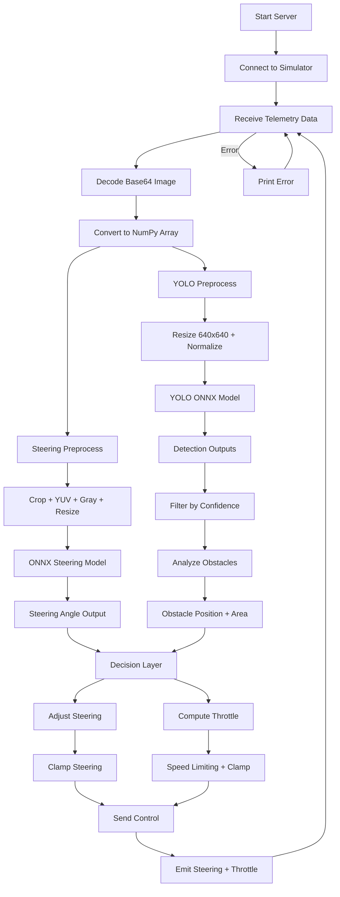

# 🚗 TraffIQ - Autonomous Vehicle AI  

## 📌 Overview  
TraffIQ is an autonomous driving system that uses deep learning models to control a vehicle in real-time using camera input. It combines **lane-following (end-to-end steering)** and **obstacle detection (YOLO)** to make intelligent driving decisions.

---

## 🧠 Features  
- 🚘 End-to-end lane detection using neural networks  
- 🚧 Real-time obstacle detection and avoidance (YOLO)  
- ⚡ Dynamic throttle and steering control  
- 🔁 Closed-loop control with simulator feedback  
- 🧩 Modular architecture (easy to extend)

---

## ⚙️ Tech Stack  
- Python  
- OpenCV  
- ONNX Runtime  
- TensorFlow / PyTorch (for training)  
- Socket.IO + Flask (real-time communication)  

---

## 🚀 How to Run  

```bash
pip install -r requirements.txt
python src/main.py
```


